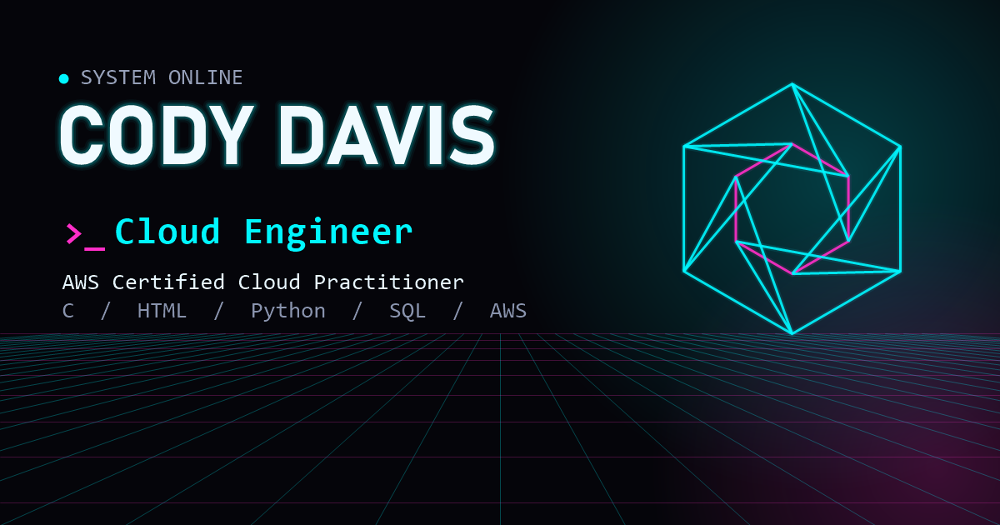

# Cody Davis — Portfolio

**Live site: [codydavis2.github.io](https://codydavis2.github.io/)**



My personal portfolio: an interactive 3D, cyberpunk-neon website built from
scratch with plain HTML, CSS and JavaScript. I'm an **AWS Certified Cloud
Practitioner** working toward my first cloud engineering role, and this site
showcases my projects, skills and how to reach me.

## Features

- **3D hero scene** — a Three.js wireframe core, particle field and scrolling
  grid floor with bloom post-processing, reacting to mouse movement and scroll.
- **Interactive skills sphere** — a draggable 3D tag cloud built with pure CSS
  3D transforms, alongside skill bars grouped by Frontend, Backend and
  Cloud / DevOps.
- **Project cards** — tilt-on-hover cards with a cursor-following glow.
- **Book a call** — a live [Calendly](https://calendly.com) embed, themed to
  match the site, so recruiters can pick a real open slot.
- **Polish** — boot-sequence loader, custom cursor, glitch text, typewriter
  headline, scroll-reveal animations, scanline overlay.
- **Responsive** — works from phone to desktop, disables the custom cursor and
  tilt effects on touch devices, and respects `prefers-reduced-motion`.

## Projects featured

| Project | What it is | Stack |
|---|---|---|
| [Dot-Tracker](https://github.com/codydavis2/dot-tracker) | Web app for fleet maintenance, inspections, work orders, scheduling and inventory, focused on simplifying DOT compliance | Python, SQL, HTML, CSS |
| [Doro Ad Designer](https://github.com/codydavis2/doro_ad_designer) | Simple ad design tool: upload images, work from layouts, save designs — no AI generation | JavaScript, Python, Flask, SQLite, HTML, CSS |
| Doro Inventory Tracker | Standalone inventory tracker with profit tracking, item location logging and low-inventory notifications | JavaScript, Python, Bootstrap, HTML, CSS |

## Tech

- HTML5, CSS3, vanilla JavaScript (ES modules) — no framework, no build step
- [Three.js](https://threejs.org) (loaded from a CDN via an import map) with
  `EffectComposer` and `UnrealBloomPass` for the neon glow
- Calendly inline widget for scheduling
- Hosted on GitHub Pages

## Project structure

```
index.html          page content and social preview tags
css/style.css       design tokens and all styling
js/scene.js         Three.js background scene
js/main.js          loader, cursor, nav, typewriter, reveal, tilt cards, skills sphere
js/schedule.js      Calendly embed
assets/             resume PDF and social preview image
serve.ps1           tiny local static server (Windows / PowerShell)
```

## Run it locally

It's a static site, so any static file server works. Opening `index.html`
directly from disk won't work, because browsers block ES module imports over
`file://`.

```bash
# Python
python -m http.server 8000

# Node
npx serve

# Windows / PowerShell (no extra tools needed)
powershell -ExecutionPolicy Bypass -File serve.ps1   # http://localhost:8123
```

## Contact

- Email: [cody.davis5614@gmail.com](mailto:cody.davis5614@gmail.com)
- LinkedIn: [in/cody-davis-257436426](https://www.linkedin.com/in/cody-davis-257436426)
- GitHub: [@codydavis2](https://github.com/codydavis2)
- Book a call: [codydavis2.github.io/#schedule](https://codydavis2.github.io/#schedule)
